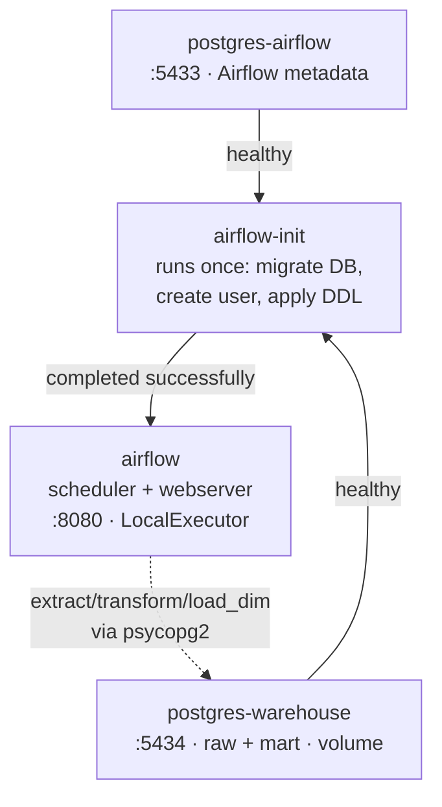
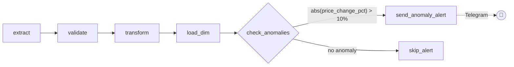

# crypto-etl-pipeline


Hourly ETL that pulls the top-100 cryptocurrencies from the CoinGecko API
into a Postgres warehouse, validates each batch, builds a small
dimensional mart (`mart.dim_coin`, `mart.fact_price_snapshot`) with
period-over-period price change, a 24h moving average and a market-cap
rank, then checks the batch for abnormal price swings and alerts on
Telegram when it finds one.

Orchestrated with Apache Airflow 2.9.0, **LocalExecutor only** (no Celery,
no Redis, no Kubernetes).

## Architecture

### Containers



- **postgres-airflow** (Postgres 15, port `5433`) — Airflow metadata DB.
- **postgres-warehouse** (Postgres 15, port `5434`, persistent volume) —
  `raw` and `mart` schemas for pipeline data.
- **airflow-init** — one-shot service: runs `airflow db migrate`, creates
  the default admin user, and applies `sql/ddl_raw.sql` /
  `sql/ddl_mart.sql` against `postgres-warehouse`. `airflow` only starts
  once this container exits successfully.
- **airflow** (`apache/airflow:2.9.0`, LocalExecutor) — runs the scheduler
  and webserver (UI on port `8080`) in a single container; `./dags` and
  `./scripts` are mounted read/write, so code changes apply without a
  rebuild.

### DAG: `crypto_price_pipeline` (schedule `@hourly`)



- **extract** — calls the CoinGecko `coins/markets` endpoint and appends
  rows to `raw.coin_snapshots` (append-only, no PK) with `ingested_at`.
- **validate** — fails the task with a clear error if the batch is empty
  or contains duplicate `(coin_id, ingested_at)` pairs.
- **transform** — runs `sql/transform_mart.sql`: computes
  `price_change_pct` via `LAG() OVER (PARTITION BY coin_id ORDER BY
  ingested_at)`, a trailing `moving_avg_24h`, and `market_cap_rank` via
  `DENSE_RANK() OVER (PARTITION BY ingested_at ORDER BY market_cap DESC)`,
  writing into `mart.fact_price_snapshot`.
- **load_dim** — runs `sql/upsert_dim_coin.sql`: upserts `mart.dim_coin`
  for new coins or coins whose name/symbol changed.
- **check_anomalies** — a `BranchPythonOperator`: reads the freshly
  computed `price_change_pct` for this batch from `mart.fact_price_snapshot`
  and branches to `send_anomaly_alert` if any coin moved more than the
  threshold in `sql/check_anomalies.sql` (currently ±10%), otherwise to
  `skip_alert` (a no-op `EmptyOperator`) — Airflow marks the branch not
  taken as `skipped`, not `failed`.
- **send_anomaly_alert** — posts the list of anomalous coins to Telegram
  via the Bot API.

Retries: `retries=2`, `retry_delay=5 minutes`. Independently of the
anomaly branch above, **any** task that fails after exhausting its
retries triggers `on_failure_callback`, which posts a separate failure
alert to Telegram — one path reports a *data-quality signal* (a real
price swing), the other reports an *infrastructure failure* (a broken
task).

## Getting started

```bash
docker-compose up -d
```

First startup will:

1. Start both Postgres instances.
2. Run `airflow-init` (DB migration, admin user, warehouse DDL).
3. Start the `airflow` container (scheduler + webserver).

Airflow UI: **http://localhost:8080** (login: `airflow` / `airflow`,
unless overridden — see below).

The `crypto_price_pipeline` DAG is unpaused manually from the UI (or via
`airflow dags unpause crypto_price_pipeline`) to start running on its
`@hourly` schedule.

To stop everything (data persists in the named volumes):

```bash
docker-compose down
```

To also wipe all data:

```bash
docker-compose down -v
```

## Configuration

### Admin user (optional)

Override the default `airflow`/`airflow` credentials created by
`airflow-init` via a `.env` file next to `docker-compose.yml`:

```
_AIRFLOW_WWW_USER_USERNAME=myuser
_AIRFLOW_WWW_USER_PASSWORD=mypassword
```

### Telegram alerts

Both the `on_failure_callback` (task failures) and the `send_anomaly_alert`
task (price anomalies) read the bot token and chat id from **Airflow
Variables** — nothing is hardcoded in the DAG or scripts.

Set them in the Airflow UI under **Admin -> Variables**, or via the CLI:

```bash
docker-compose exec airflow airflow variables set telegram_bot_token "<your-bot-token>"
docker-compose exec airflow airflow variables set telegram_chat_id "<your-chat-id>"
```

If these variables are not set, both alerts are skipped (a warning is
logged) instead of crashing.

The anomaly threshold itself (currently ±10% in one hour) is not a
Variable — it's the literal `10` in `sql/check_anomalies.sql`, edit that
file directly to tune it.

### Warehouse connection

`scripts/db.py` reads the warehouse connection from environment
variables (`WAREHOUSE_DB_HOST`, `WAREHOUSE_DB_PORT`, `WAREHOUSE_DB_NAME`,
`WAREHOUSE_DB_USER`, `WAREHOUSE_DB_PASSWORD`), already set in
`docker-compose.yml` to match the `postgres-warehouse` service.

## Project layout

```
docker-compose.yml
dags/
  crypto_pipeline_dag.py     # crypto_price_pipeline DAG definition
scripts/
  db.py                      # psycopg2 connection helper
  extract.py                 # CoinGecko -> raw.coin_snapshots
  validate.py                # batch validation (no dupes, not empty)
  transform.py               # runs sql/transform_mart.sql
  load_dim.py                # runs sql/upsert_dim_coin.sql
  check_anomalies.py         # BranchPythonOperator: runs sql/check_anomalies.sql
  telegram_alert.py          # on_failure_callback + anomaly alert -> Telegram Bot API
  init_warehouse.py          # applies DDL, run once by airflow-init
sql/
  ddl_raw.sql                # raw schema + coin_snapshots table
  ddl_mart.sql                # mart schema + dim_coin / fact_price_snapshot
  transform_mart.sql          # LAG()/window transform query
  upsert_dim_coin.sql         # dim_coin upsert
  check_anomalies.sql         # anomaly threshold query over fact_price_snapshot
requirements.txt              # psycopg2-binary, requests (installed into
                               # the airflow image via _PIP_ADDITIONAL_REQUIREMENTS)
```

## Manually inspecting the warehouse

```bash
docker-compose exec postgres-warehouse psql -U warehouse -d warehouse
```

```sql
select * from raw.coin_snapshots order by ingested_at desc limit 10;
select * from mart.fact_price_snapshot order by snapshot_time desc limit 10;
select * from mart.dim_coin;
```
